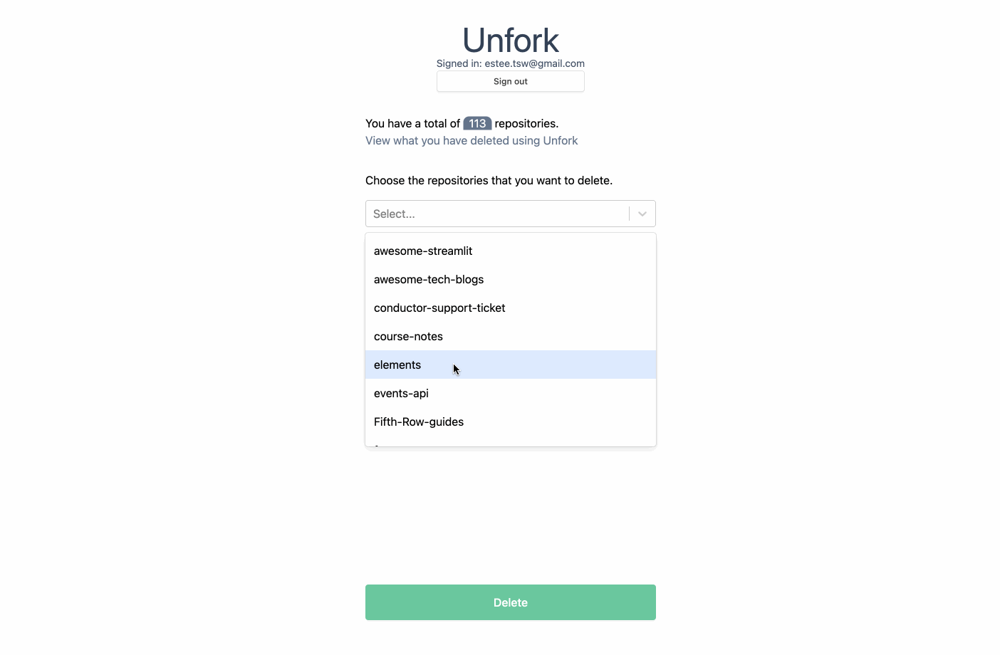

<h3>Unfork</h3>

## Features

[Unfork](http://unfork.vercel.app/) will help you to easily identify all the forks that you have made over the _months_ or _years_ and **unfork** them all!

- [x] View your repository count.
- [x] You can choose what repos to delete before actually deleting them.
- [x] View what the forks that you have deleted.
- [ ] Generates an optional shell command for you to run to backup all the forks that you are going to delete before deleting them.

## Problem

GitHub forks tend to be created for the following reasons:
1. Following tutorials 📖
1. Contributing to open source projects 💻
1. GitHub automatically forking stuff for you when you just wanted to view the source code for a particular file of a project 😆

After months and years, usually these forks still stay in your repository — and that's because of how inconvenient it is to identify and delete the many forks that you have made. This results in cluttering of your GitHub profile. Unfork helps you to declutter easily ✨

## Tech Notes

This project is bootstrapped by:
- [Typescript Next.js starter by @jpedroschmitz](https://github.com/jpedroschmitz/typescript-nextjs-starter)
- [Supabase](https://github.com/supabase/supabase/)
- [React Select](https://react-select.com/)
- [Tailwind CSS](https://tailwindcss.com/)

For lessons learnt, you can refer to [notes.md](notes.md).

## License

This project is licensed under the MIT License - see the [LICENSE.md](LICENSE.md) file for more information.
